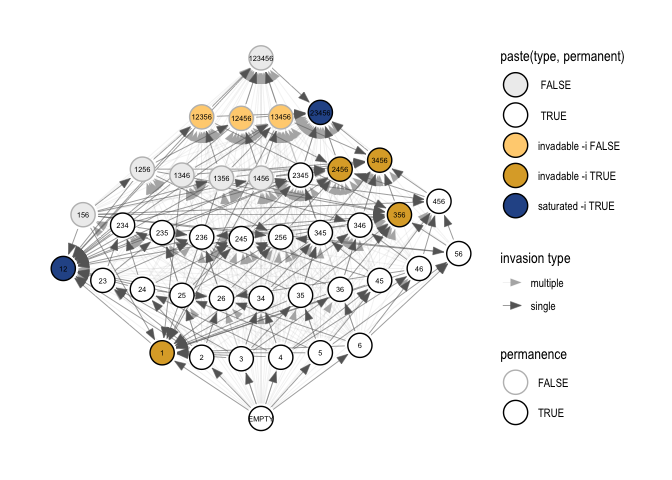

<!-- README.md is generated from README.Rmd. Please edit that file -->

# invasiongraph

<!-- badges: start -->

[](https://github.com/DICELab-NCSU/invasiongraph/actions/workflows/R-CMD-check.yaml)
[](https://lifecycle.r-lib.org/articles/stages.html#experimental)
<!-- badges: end -->

The goal of `invasiongraph` is to compute the potential community
assembly pathways for a community of interacting species. The core
functions in this package come from the R code archive that accompanies:

> Hofbauer, J., Schreiber, S.J. (2022) Permanence via invasion graphs:
> incorporating community assembly into modern coexistence theory. J.
> Math. Biol. 85:54. <https://doi.org/10.1007/s00285-022-01815-2>

In addition to the more accessible format of an R package, we have
added:

- Checks and informative error messages
- Grammar of Graphics plotting via `tidygraph` and `ggraph`
- (planned) Dedicated object classes
- (planned) Support for uncertainty propagation

## Installation

You can install the development version of `invasiongraph` from
[GitHub](https://github.com/) with:

``` r
# install.packages("remotes")
remotes::install_github("DICELab-NCSU/invasiongraph")
```

## Core functionality

### Simulate data for a Lotka-Volterra competitive system

``` r
library(invasiongraph)

# simulate Lotka-Volterra system
set.seed(2332)
n <- 6  # number of species
A <- -diag(n) - 1.5 * matrix(runif(n^2), n, n)  # interaction matrix
r <- matrix(1, n, 1)  # intrinsic growth rates
```

### Calculate invasion schemes and graphs

``` r
# compute the invasion scheme
sch <- inv_scheme(A, r)

# calculate the invasion graph
gra <- inv_graph(IS = sch)
```

### Visualize invasion graphs

``` r
# tidy invasion graph to prepare for plotting
tidy_gra <- tidy_inv_graph(gra)

# plot
ggIG(tidy_gra, node_size = 8, edge_width = c(0.05, 0.2))
```

 \###
Propagating uncertainty

### Distinguishing invasion graphs
